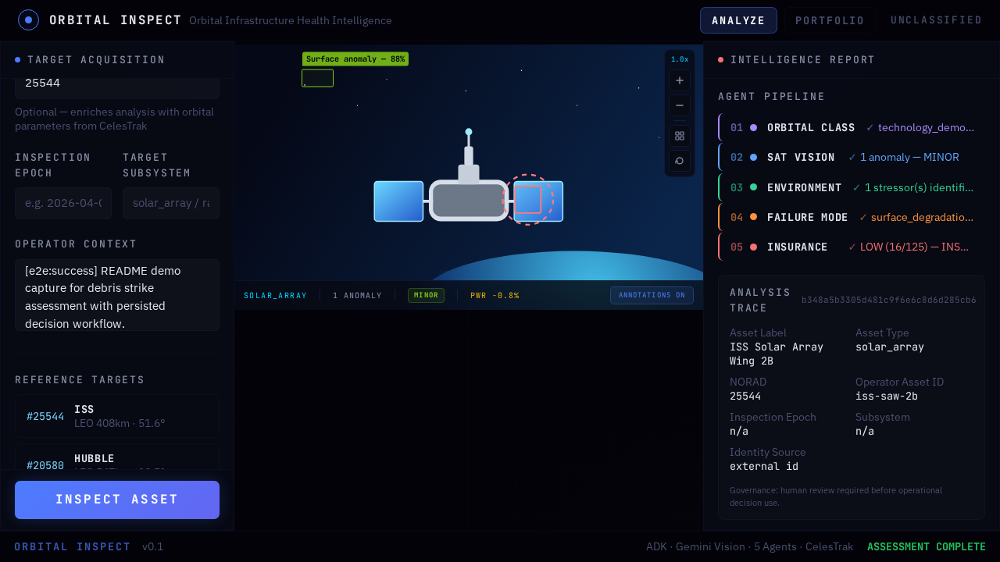
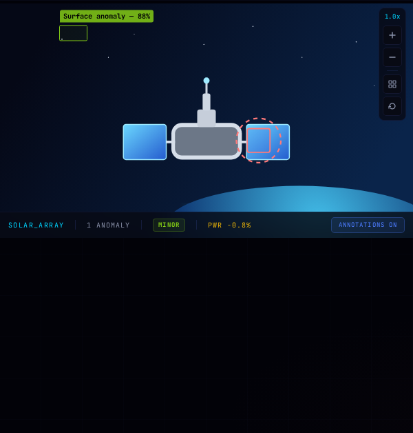
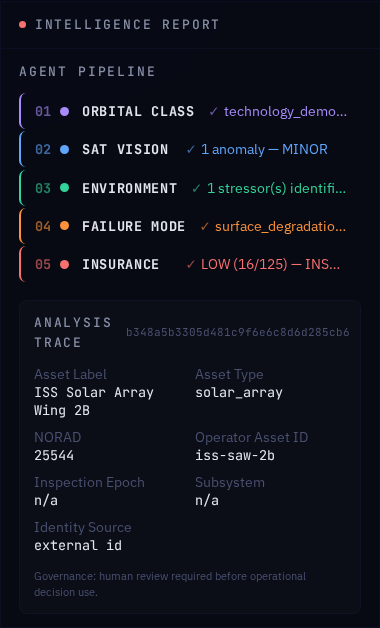
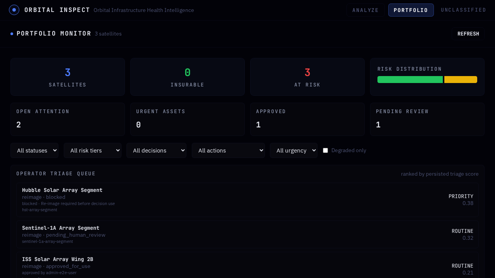

<p align="center">
  
  
  
  
  
  
</p>

# Orbital Inspect

**AI-powered satellite inspection and risk intelligence platform for orbital asset operators, insurers, and defense primes.**

Upload a satellite image. Get a complete underwriting intelligence report in under 45 seconds. Track degradation across your entire fleet. Know when to act before it's too late.

```
                        ┌─────────────────────────────────────────────────────┐
                        │              ORBITAL INSPECT                       │
                        │   "Bloomberg Terminal meets SpaceX Mission Control"│
                        └─────────────────────────┬───────────────────────────┘
                                                  │
                    ┌─────────────────────────────┼─────────────────────────────┐
                    │                             │                             │
              ┌─────▼─────┐               ┌──────▼──────┐              ┌───────▼──────┐
              │  INSPECT   │               │   PREDICT   │              │   PROTECT    │
              │            │               │             │              │              │
              │ 5-Agent AI │               │ Degradation │              │ ITAR/CUI     │
              │ Pipeline   │               │ Trend       │              │ Classification│
              │            │               │ Analysis    │              │              │
              │ Upload     │               │ Fleet-wide  │              │ Feature Flags │
              │ image ->   │               │ risk        │              │ Audit Trail   │
              │ full risk  │               │ forecasting │              │ Role-based    │
              │ report     │               │             │              │ access        │
              └────────────┘               └─────────────┘              └──────────────┘
```

---

## Why Orbital Inspect?

The space economy is worth **$630B** and growing. Every satellite operator, insurer, and defense prime needs answers to the same question: **Is this asset safe to operate, insure, or extend?**

Orbital Inspect answers that question with AI, real data, and provable methodology.

| What You Need | What We Do |
|---|---|
| **Inspect a satellite** | 5-agent AI pipeline analyzes imagery + 7 free data sources |
| **Underwrite the risk** | Composite risk scoring with fail-closed safety guarantees |
| **Monitor a fleet** | Continuous ingestion of orbital, conjunction, and weather data |
| **Predict degradation** | Linear regression trends with time-to-threshold predictions |
| **Prove reliability** | SLO dashboard: 99.5% pipeline completion, p95 < 45s |
| **Deploy anywhere** | Helm chart, air-gap compatible, no SaaS dependencies |

---

## Product Demo

<p align="center">
  
</p>

<p align="center">
  <strong>Best first demo:</strong> start with a known orbital incident, stream the 5-agent evidence chain, convert it into an auditable human decision, then zoom out to fleet triage.
</p>

Orbital Inspect should be demoed as a decision intelligence platform, not a generic AI image analyzer. The README demo story is designed to prove four things quickly: the system reaches signal fast, shows evidence instead of hand-waving, keeps a human in control of the final action, and scales from a single anomaly to an operational fleet queue.

| In 3 to 5 minutes, prove this | Demo surface |
|---|---|
| **Speed to signal** | Pre-configured demo cases, live SSE analysis, visible stage progression |
| **Evidence over vibes** | Visual inspection overlays, evidence lineage, per-stage outputs |
| **Human control** | Review actions, fail-closed escalation, signed PDF export |
| **Fleet relevance** | Portfolio filters, degradation trends, open attention queue |

### Recommended walkthrough

1. Start with `ISS — Debris Strike` or `SENTINEL-1A — Impact` from the demo selector so the audience sees a recognizable orbital event immediately.
2. Let the live 5-agent pipeline run onscreen and narrate the handoff: orbital classification, visual damage assessment, environmental hazard analysis, failure mode analysis, and insurance risk synthesis.
3. Pause on the intelligence panel and call out the exact trust mechanism: if evidence is incomplete or a stage fails, the system escalates to `FURTHER_INVESTIGATION` instead of inventing certainty.
4. Generate the PDF artifact to show the output is operational, portable, and reviewable outside the UI.
5. Switch to `PORTFOLIO` and show that the same product can rank risk, filter decision states, and surface the open attention queue across a fleet.

### Demo gallery

The images below are real local captures generated from the running product. The SVG files in the same directory remain available as editable storyboard fallbacks.

| Analyze Surface | Decision + Report | Portfolio Surface |
|---|---|---|
|  |  |  |

### Run the local demo

```bash
# Terminal 1
cd backend
DEMO_MODE=true GEMINI_API_KEY=test-dummy-key \
  python -m uvicorn main:app --host 0.0.0.0 --port 8000

# Terminal 2
cd frontend
npm install
npm run dev -- --host 0.0.0.0 --port 5173
```

Open `http://localhost:5173`, launch a built-in demo case, let the pipeline finish, generate the report, then switch to `PORTFOLIO`.

### Recording notes

- Lead with the operator question: "Can we keep this asset in service, insure it, or escalate now?"
- Keep the first demo reproducible by using the built-in cases before showing custom upload flows.
- Narrate the fail-closed design explicitly because it is the main trust differentiator.
- Use the portfolio view as the close so the story ends on operational leverage, not a single-screen analysis.
- Refresh the local README captures with `cd frontend && npm run demo:assets`.
- For the full talk track, shot list, and asset replacement plan, see [`docs/demo/DEMO-RUNBOOK.md`](docs/demo/DEMO-RUNBOOK.md).

---

## Architecture

### System Overview

```
┌──────────────────────────────────────────────────────────────────────────────────────┐
│                                    FRONTEND                                          │
│  React 18 + TypeScript + Vite + Tailwind + D3.js + Three.js                         │
│                                                                                      │
│  ┌──────────────┐  ┌──────────────┐  ┌──────────────┐  ┌────────────────────────┐   │
│  │  Analysis     │  │  Portfolio   │  │  Decision    │  │  3D Satellite          │   │
│  │  Submission   │  │  Dashboard   │  │  Workflow    │  │  Viewer + D3 Charts    │   │
│  └──────┬───────┘  └──────┬───────┘  └──────┬───────┘  └────────────┬───────────┘   │
│         │                 │                 │                        │               │
│         └─────────────────┼─────────────────┼────────────────────────┘               │
│                           │   SSE + REST + fetchWithRetry                            │
└───────────────────────────┼──────────────────────────────────────────────────────────┘
                            │
                    ┌───────▼───────┐
                    │   NGINX /     │
                    │   Ingress     │
                    │   TLS + CORS  │
                    └───────┬───────┘
                            │
┌───────────────────────────┼──────────────────────────────────────────────────────────┐
│                      API LAYER (FastAPI)                                              │
│                                                                                      │
│  ┌─────────────┐  ┌───────────────┐  ┌─────────────┐  ┌────────────────────────┐    │
│  │ /api/v1/    │  │ /api/v1/      │  │ /api/v1/    │  │  Middleware Stack      │    │
│  │ analyses    │  │ portfolio     │  │ trends      │  │                        │    │
│  │ assets      │  │ batch         │  │ webhooks    │  │  - API Version Rewrite │    │
│  │ decisions   │  │ reports       │  │ admin       │  │  - RFC 7807 Errors     │    │
│  │ datasets    │  │ precedents    │  │ demos       │  │  - Security Headers    │    │
│  └──────┬──────┘  └───────┬───────┘  └──────┬──────┘  │  - Request Logging     │    │
│         │                 │                 │         │  - Rate Limiting        │    │
│         └─────────────────┼─────────────────┘         │  - Auth (JWT + API Key)│    │
│                           │                           └────────────────────────┘    │
└───────────────────────────┼──────────────────────────────────────────────────────────┘
                            │
┌───────────────────────────┼──────────────────────────────────────────────────────────┐
│                      SERVICE LAYER (44 Services)                                     │
│                                                                                      │
│  ┌──────────────────────────────────────────────────────────────────────────────┐    │
│  │                    5-AGENT AI PIPELINE (Gemini 3.1)                          │    │
│  │                                                                              │    │
│  │  ┌──────────┐  ┌──────────┐  ┌──────────┐  ┌──────────┐  ┌──────────────┐  │    │
│  │  │ Orbital  │  │Satellite │  │ Orbital  │  │ Failure  │  │  Insurance   │  │    │
│  │  │ Classif. │─>│ Vision   │─>│ Environ. │─>│ Mode     │─>│  Risk        │  │    │
│  │  │          │  │          │  │          │  │          │  │              │  │    │
│  │  │ Type,bus │  │ Damage   │  │ Debris,  │  │ FMEA,    │  │ Risk matrix, │  │    │
│  │  │ regime   │  │ assess.  │  │ weather, │  │ history, │  │ composite    │  │    │
│  │  │ reject?  │  │ surface  │  │ radiation│  │ predict  │  │ score, tier  │  │    │
│  │  └──────────┘  └──────────┘  └──────────┘  └──────────┘  └──────────────┘  │    │
│  │                                                                              │    │
│  │  Circuit breaker + retry + fail-closed (any gap -> FURTHER_INVESTIGATION)    │    │
│  └──────────────────────────────────────────────────────────────────────────────┘    │
│                                                                                      │
│  ┌────────────────┐  ┌────────────────┐  ┌────────────────┐  ┌────────────────┐     │
│  │ Fleet Ingestion│  │ Trend Analysis │  │ Alert Service  │  │ SLO Service    │     │
│  │                │  │                │  │                │  │                │     │
│  │ Periodic TLE,  │  │ Linear regress.│  │ Conjunction,   │  │ Pipeline rate, │     │
│  │ conjunction,   │  │ 30/90d predict │  │ risk, staleness│  │ p95 latency,   │     │
│  │ weather ingest │  │ time-to-thresh.│  │ triage alerts  │  │ freshness, wh. │     │
│  └────────────────┘  └────────────────┘  └────────────────┘  └────────────────┘     │
│                                                                                      │
│  ┌────────────────┐  ┌────────────────┐  ┌────────────────┐  ┌────────────────┐     │
│  │ Cache Service  │  │ Classification │  │ Feature Flags  │  │ Retention      │     │
│  │                │  │ Marking        │  │                │  │ Service        │     │
│  │ Redis + LRU    │  │ ITAR/CUI/PROP  │  │ Per-org, no    │  │ Configurable   │     │
│  │ fallback       │  │ propagation    │  │ SaaS deps      │  │ purge + audit  │     │
│  └────────────────┘  └────────────────┘  └────────────────┘  └────────────────┘     │
└───────────────────────────────────────────────────────────────────────────────────────┘
                            │
┌───────────────────────────┼──────────────────────────────────────────────────────────┐
│                      DATA LAYER                                                      │
│                                                                                      │
│  ┌────────────────┐  ┌────────────────┐  ┌────────────────┐  ┌────────────────┐     │
│  │  PostgreSQL    │  │  Redis         │  │  S3 / MinIO    │  │  ARQ Worker    │     │
│  │  (SQLite dev)  │  │  (optional)    │  │  (or local FS) │  │  Queue         │     │
│  │                │  │                │  │                │  │                │     │
│  │  18 tables     │  │  Rate limiting │  │  Images,       │  │  Retry, DLQ,   │     │
│  │  Alembic       │  │  Caching       │  │  reports,      │  │  dead-letter   │     │
│  │  migrations    │  │  Sessions      │  │  artifacts     │  │  persistence   │     │
│  └────────────────┘  └────────────────┘  └────────────────┘  └────────────────┘     │
└──────────────────────────────────────────────────────────────────────────────────────┘
                            │
┌───────────────────────────┼──────────────────────────────────────────────────────────┐
│                      FREE DATA SOURCES (No API Keys Required)                        │
│                                                                                      │
│  ┌──────────────┐ ┌──────────────┐ ┌──────────────┐ ┌──────────────┐ ┌───────────┐ │
│  │  CelesTrak   │ │  SOCRATES    │ │  NOAA SWPC   │ │  SatNOGS     │ │  UCS DB   │ │
│  │              │ │              │ │              │ │              │ │           │ │
│  │  TLE/orbital │ │  Conjunction │ │  Kp, proton, │ │  Ground stn  │ │  Satellite│ │
│  │  elements    │ │  close-      │ │  X-ray, wind │ │  RF activity │ │  registry │ │
│  │  + catalog   │ │  approach    │ │  Bz, alerts  │ │  observations│ │  metadata │ │
│  └──────────────┘ └──────────────┘ └──────────────┘ └──────────────┘ └───────────┘ │
│                                                                                      │
│  ┌──────────────┐ ┌──────────────────────────────────────────────────────────────┐   │
│  │ ORDEM 4.0    │ │  All sources are freely available. No contracts required.    │   │
│  │ (reference)  │ │  Every data point is persisted with source, confidence,      │   │
│  │ Debris flux  │ │  and redistribution metadata for full evidence provenance.   │   │
│  └──────────────┘ └──────────────────────────────────────────────────────────────┘   │
└──────────────────────────────────────────────────────────────────────────────────────┘
```

### Analysis Pipeline Flow

```
    Image Upload                    5-Agent Pipeline                      Output
  ┌─────────────┐    ┌──────────────────────────────────────────┐    ┌──────────────┐
  │             │    │                                          │    │              │
  │  Satellite  │    │  Stage 1: ORBITAL CLASSIFICATION         │    │  Risk Matrix │
  │  Image      │───>│  - Satellite type, bus platform          │───>│  - Composite │
  │  + Context  │    │  - Orbital regime (LEO/MEO/GEO/HEO)     │    │    score     │
  │  + NORAD ID │    │  - Fail-closed: invalid -> REJECTED      │    │  - Risk tier │
  │             │    │                                          │    │  - Financial │
  └─────────────┘    │  Stage 2: SATELLITE VISION               │    │    exposure  │
                     │  - Micrometeorite damage detection        │    │              │
  ┌─────────────┐    │  - Solar cell degradation assessment     │    │  Underwriting│
  │ Free Data   │    │  - Thermal anomaly identification        │    │  Recommend.  │
  │ Enrichment  │    │                                          │    │  - INSURABLE │
  │             │    │  Stage 3: ORBITAL ENVIRONMENT             │    │  - ELEVATED  │
  │ CelesTrak   │───>│  - ORDEM debris flux at altitude         │    │  - HIGH_RISK │
  │ SOCRATES    │    │  - NOAA space weather conditions          │    │  - FURTHER   │
  │ NOAA SWPC   │    │  - Radiation and thermal environment     │    │    INVEST.   │
  │ SatNOGS     │    │                                          │    │              │
  │ UCS         │    │  Stage 4: FAILURE MODE ANALYSIS           │    │  Triage      │
  │ ORDEM       │    │  - Historical precedent matching          │    │  - Band      │
  └─────────────┘    │  - FMEA-style failure mechanism ID        │    │  - Score     │
                     │  - Remaining useful life estimate         │    │  - Urgency   │
                     │                                          │    │              │
                     │  Stage 5: INSURANCE RISK SYNTHESIS        │    │  Decision    │
                     │  - Multi-factor risk matrix               │    │  - Approve   │
                     │  - If ANY gap -> FURTHER_INVESTIGATION    │    │  - Block     │
                     │  - Financial exposure estimation          │    │  - Override  │
                     └──────────────────────────────────────────┘    └──────────────┘

                     ┌──────────────────────────────────────────┐
                     │  SAFETY GUARANTEES                        │
                     │                                          │
                     │  - Fail-closed: gaps force escalation     │
                     │  - Circuit breaker on Gemini calls        │
                     │  - Evidence provenance on every record    │
                     │  - Audit trail for all decisions           │
                     │  - Admin-only exception overrides          │
                     └──────────────────────────────────────────┘
```

### Deployment Architecture

```
                              ┌─────────────────────────┐
                              │    DNS / Load Balancer   │
                              │    (Route53/Cloudflare)  │
                              └────────────┬────────────┘
                                           │
                              ┌────────────▼────────────┐
                              │       Ingress           │
                              │   TLS + Rate Limiting   │
                              └──────┬──────────┬───────┘
                                     │          │
                          ┌──────────▼──┐  ┌────▼──────────┐
                          │  Frontend   │  │   API Server   │
                          │  (Nginx)    │  │   (uvicorn)    │
                          │             │  │                │
                          │  React SPA  │  │  HPA: 2-10    │
                          │  Static     │  │  CPU target:   │
                          │  assets     │  │  70%           │
                          └─────────────┘  └────┬──────────┘
                                                │
                                    ┌───────────┼───────────┐
                                    │           │           │
                              ┌─────▼───┐ ┌────▼────┐ ┌────▼────┐
                              │Postgres │ │  Redis  │ │   S3    │
                              │         │ │         │ │  MinIO  │
                              │ Primary │ │ Cache + │ │         │
                              │ + Read  │ │ Rate    │ │ Images  │
                              │ Replica │ │ Limiter │ │ Reports │
                              └─────────┘ └─────────┘ └─────────┘
                                                │
                              ┌─────────────────▼───────────────┐
                              │         ARQ Worker              │
                              │                                 │
                              │  Background analysis jobs       │
                              │  Fleet ingestion pipeline       │
                              │  Retention purge                │
                              │  Dead-letter retry              │
                              └─────────────────────────────────┘
```

---

## Key Features

### 5-Agent AI Pipeline
Upload a satellite image with operator context. Five specialized Gemini-powered agents analyze it sequentially: orbital classification, visual damage assessment, environmental hazard evaluation, failure mode analysis, and insurance risk synthesis. Each stage enriches the next. If any stage fails, the system forces `FURTHER_INVESTIGATION` -- never a false positive clearance.

### Fleet-Scale Operations
Monitor 6,000+ satellites with sub-second portfolio queries. Periodic fleet ingestion pulls TLE data, conjunction events, and space weather for every tracked asset. Cached portfolio summaries prevent database bottlenecks. Batch analysis endpoint processes up to 100 assets per request.

### Predictive Intelligence
For assets with 3+ historical analyses, Orbital Inspect computes degradation trajectories using linear regression on composite risk scores. Predicts scores at 30 and 90 days. Calculates time-to-threshold for the "UNINSURABLE" level (85/100). Classifies degradation velocity as stable, slow, moderate, rapid, or critical.

### Provable Reliability
Four SLO targets measured from real data: pipeline completion rate (99.5%), p95 latency (<45s), evidence freshness (<4h), and webhook delivery (99%). Error budget tracking shows how much margin remains before a target is breached.

### ITAR/CUI Compliance
Classification marking service assigns sensitivity levels (UNCLASSIFIED, CUI, ITAR_CONTROLLED, PROPRIETARY) based on data source. Classifications propagate through the evidence chain -- the highest classification wins. Feature flags are database-backed with per-org overrides, requiring zero SaaS dependencies for classified environments.

### Evidence Provenance
Every data point carries source URL, provider identity, confidence score, capture timestamp, and redistribution metadata. Evidence is linked to analyses through explicit provenance records, not opaque JSON blobs. The system distinguishes between runtime evidence, reference baselines, and offline evaluation datasets.

---

## Quick Start

### Prerequisites

- Python 3.13+
- Node.js 22+
- A Gemini API key (free tier works)

### Backend

```bash
cd backend
pip install -r requirements.txt
alembic -c alembic.ini upgrade head

# Demo mode (no real Gemini calls needed)
DEMO_MODE=true GEMINI_API_KEY=test-dummy-key \
  python -m uvicorn main:app --host 0.0.0.0 --port 8000

# Production mode
GEMINI_API_KEY=your_key_here \
  python -m uvicorn main:app --host 0.0.0.0 --port 8000
```

### Frontend

```bash
cd frontend
npm install
npm run dev -- --host 0.0.0.0 --port 5173
```

Open **http://localhost:5173** -- use the demo selector (Hubble, ISS, Sentinel-1A) for pre-configured analyses.

### Docker Compose

```bash
# Full stack with Postgres, Redis, MinIO
docker compose --profile full up --build

# Full stack + observability (Prometheus, Grafana, Tempo, Alertmanager)
docker compose -f docker-compose.yml -f docker-compose.observability.yml --profile full up --build
```

---

## API Reference

### Core Endpoints (v1)

| Method | Endpoint | Description |
|--------|----------|-------------|
| `POST` | `/api/v1/analyses` | Submit analysis with image + context |
| `GET` | `/api/v1/analyses/{id}` | Get analysis result |
| `GET` | `/api/v1/analyses/{id}/events/stream` | SSE event stream |
| `GET` | `/api/v1/analyses/{id}/evidence` | Evidence lineage |
| `POST` | `/api/v1/batch/analyses` | Batch submit (up to 100) |
| `GET` | `/api/v1/batch/{id}` | Batch job status |

### Fleet & Portfolio

| Method | Endpoint | Description |
|--------|----------|-------------|
| `GET` | `/api/v1/portfolio` | Fleet portfolio with triage ranking |
| `GET` | `/api/v1/portfolio/summary` | Fleet summary statistics |
| `GET` | `/api/v1/trends/assets/{id}` | Asset degradation trend |
| `GET` | `/api/v1/trends/portfolio` | Fleet-wide trend summary |
| `GET` | `/api/v1/assets/{id}` | Asset detail with evidence |
| `GET` | `/api/v1/assets/{id}/timeline` | Multi-epoch analysis history |

### Decision Workflow

| Method | Endpoint | Description |
|--------|----------|-------------|
| `POST` | `/api/v1/analyses/{id}/decision/review` | Approve / Block / Override |
| `GET` | `/api/v1/reports/{id}/generate-pdf` | Generate signed PDF report |
| `GET` | `/api/v1/reports/artifacts/{token}` | Download report artifact |

### Infrastructure

| Method | Endpoint | Description |
|--------|----------|-------------|
| `GET` | `/api/health` | Health check |
| `GET` | `/api/ready` | Readiness probe (DB + dependencies) |
| `GET` | `/api/metrics` | Application metrics (JSON) |
| `GET` | `/api/metrics/prometheus` | Prometheus scrape endpoint |
| `GET` | `/openapi.json` | OpenAPI 3.1 specification (40+ endpoints) |

**Backward compatibility**: All legacy `/api/X` paths transparently route to `/api/v1/X` via ASGI middleware. Zero client breakage.

---

## Technology Stack

### Backend (30K+ LOC)

| Component | Technology |
|-----------|-----------|
| Framework | FastAPI 0.115 with async/await |
| AI Engine | Google Gemini 3.1 (ADK + raw fallback) |
| Database | PostgreSQL 16 (prod) / SQLite (dev) |
| ORM | SQLAlchemy 2.0 async |
| Migrations | Alembic with test coverage |
| Queue | ARQ (Redis-backed async workers) |
| Cache | Redis 7 with in-memory LRU fallback |
| Auth | JWT + API key + role-based access |
| Storage | S3-compatible (MinIO/AWS) or local FS |
| Observability | OpenTelemetry + Prometheus + Grafana + Tempo |
| Resilience | Circuit breaker + retry + dead-letter queue |

### Frontend

| Component | Technology |
|-----------|-----------|
| Framework | React 18 + TypeScript (strict) |
| Build | Vite 6 |
| Styling | Tailwind CSS (dark-first design system) |
| 3D | Three.js (satellite viewer) |
| Charts | D3.js (risk heatmap, degradation timeline, trend charts) |
| Testing | Vitest (unit) + Playwright (E2E) |
| Telemetry | Error capture + buffered flush + API retry with exponential backoff |

### Infrastructure

| Component | Technology |
|-----------|-----------|
| Container | Docker + Docker Compose |
| Orchestration | Kubernetes (Helm chart with 11 templates) |
| Scaling | HPA (min 2, max 10, CPU 70%) |
| Network | Network policies (API-DB, API-Redis, Frontend-API only) |
| TLS | Ingress with cert-manager |
| Multi-region | Active-passive with Postgres streaming replication |

---

## Free Data Sources

Orbital Inspect operates entirely on **freely available public data** -- no contracts, no API keys, no vendor lock-in.

| Source | Data | Endpoint | Update Frequency |
|--------|------|----------|-----------------|
| **CelesTrak** | TLE/orbital elements, satellite catalog | celestrak.org/NORAD | Near real-time |
| **SOCRATES** | Conjunction close-approach events | celestrak.org/SOCRATES | Daily |
| **NOAA SWPC** | Kp index, proton flux, X-ray flux, solar wind, Bz, alerts, forecasts | services.swpc.noaa.gov | 1-min to hourly |
| **SatNOGS** | Ground station RF observations | network.satnogs.org/api | Real-time |
| **UCS Database** | Satellite registry (operator, purpose, orbit) | ucsusa.org | Quarterly |
| **ORDEM 4.0** | Debris flux density by altitude | Reference tables (static) | Published data |

All data is persisted with source URL, provider identity, confidence score, and redistribution metadata for complete evidence provenance.

---

## Testing

```bash
# Backend (221 tests)
cd backend && python -m pytest tests/ -q

# Frontend unit (16 tests)
cd frontend && npm test

# Frontend E2E (11 tests, Playwright)
cd frontend && npm run test:e2e

# Deployment smoke test (13 checks)
bash ops/scripts/smoke_test.sh http://localhost:8000
```

**Current verification snapshot:**

| Suite | Result | Coverage |
|-------|--------|----------|
| Backend pytest | 221 passed | Auth, pipeline, evidence, decisions, webhooks, migrations |
| Frontend Vitest | 16 passed | Components, hooks, utilities |
| Playwright E2E | 11 passed | Full-stack: submit, stream, decide, report, portfolio |
| Smoke test | 13 passed | Health, API routing, backward compat, error envelope, demo |

---

## Deployment

### Kubernetes (Helm)

```bash
# Lint chart
helm lint ops/helm/orbital-inspect/

# Deploy
helm install orbital-inspect ops/helm/orbital-inspect/ \
  --set postgresql.existingSecret=orbital-inspect-db \
  --set redis.existingSecret=orbital-inspect-redis \
  --set auth.existingSecret=orbital-inspect-jwt \
  --set gemini.existingSecret=orbital-inspect-gemini
```

### Production Runbook

See [`ops/runbook/DEPLOYMENT.md`](ops/runbook/DEPLOYMENT.md) -- a 1,090-line step-by-step guide covering:
- PostgreSQL, Redis, S3/MinIO setup
- Environment variable reference (auto-generated from `config.py`)
- TLS termination with Let's Encrypt
- Monitoring stack (OTel + Prometheus + Grafana)
- 11 troubleshooting scenarios

### Multi-Region

See [`ops/architecture/MULTI_REGION.md`](ops/architecture/MULTI_REGION.md) for active-passive deployment across 2 regions with RTO < 5 minutes and RPO < 1 minute.

---

## Project Structure

```
orbital-inspect/
  backend/
    agents/              # 5 Gemini-powered analysis agents + orchestrator
    api/                 # 12 API route modules (v1 versioned)
    auth/                # JWT + API key + role-based access control
    db/                  # SQLAlchemy models, repository, batch models
    services/            # 44 business services
    workers/             # ARQ background job workers
    tests/               # 28 test modules (221 tests)
    alembic/             # Database migration history
    middleware/          # Request logging, security headers
    scripts/             # Utilities (OpenAPI export, backfill, seeding)
  frontend/
    src/
      components/        # React components (portfolio, viz, analysis)
      hooks/             # Custom hooks (SSE, analysis state, auth)
      utils/             # API client, formatting, retry logic
      services/          # Error telemetry
    e2e/                 # Playwright E2E test suite
  ops/
    helm/                # Kubernetes Helm chart (11 templates)
    runbook/             # Production deployment guide
    architecture/        # Multi-region architecture document
    scripts/             # Deployment smoke test
    observability/       # OTel Collector, Prometheus, Grafana configs
```

---

## Decision Workflow

The `Recommended Action` panel is an operator review surface, not an autonomous command layer.

```
  Analysis Complete
        │
        ▼
  ┌─────────────┐     ┌─────────────┐     ┌─────────────┐
  │  pending_    │────>│  pending_    │────>│  approved_   │
  │  policy      │     │  human_      │     │  for_use     │
  │              │     │  review      │     │              │
  └─────────────┘     └──────┬──────┘     └─────────────┘
                             │
                             ├──────────────>  blocked
                             │
                             └──────────────>  override (admin-only,
                                               requires reason code
                                               + written rationale)
```

---

## Multi-Model AI Engineering

This project uses a structured multi-model AI workflow:

| Model | Role | Scope |
|-------|------|-------|
| **Claude Opus 4.6** | Primary builder | Feature implementation, tests, documentation |
| **Codex GPT 5.4** | Architecture auditor | Pre-commit review, scalability analysis |
| **Gemini 3.1** | Runtime AI engine | 5-agent analysis pipeline |

Every commit includes `Co-Authored-By` attribution. The git history is the audit trail.

---

## License

[Business Source License 1.1](LICENSE) -- free for non-competing production use. Converts to Apache 2.0 after 4 years.

---

<p align="center">
  <strong>Orbital Inspect</strong> -- See what others miss. Know before they ask.
</p>
